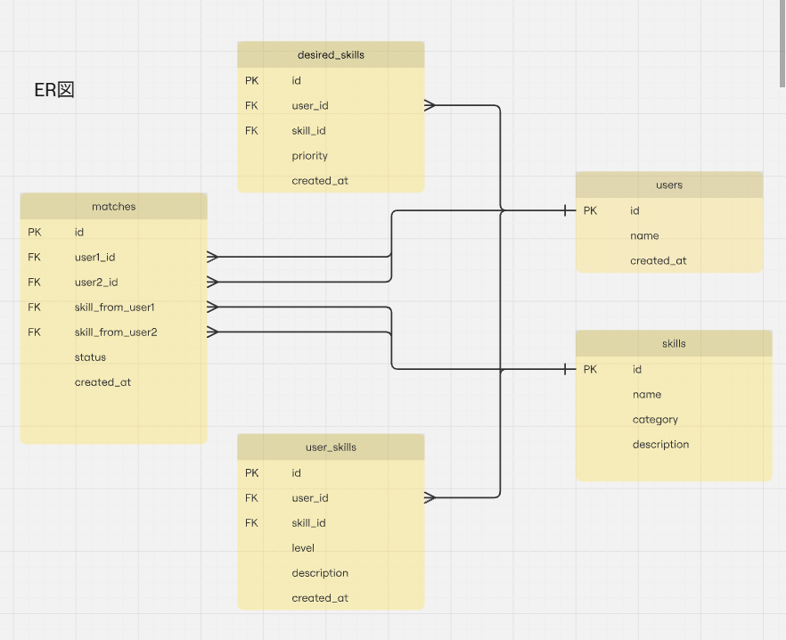

# Skill-Exchange

## 開発手順
チーム開発でのルールを定めてあるのでコードをpull,clone（ローカルに取り込む）前にWikiを見てほしいです。

## ブランチ戦略
Github Flowです。なのでブランチのマージ後は必ず削除をするようにしてください。

## フローの流れ（コンフリクト回避のため）
 - あらかじめmainリポジトリへのpushは禁止をしております。なのでフォルダを中心に役割を分けてなるべくコンフリクトを起こさない。
 - 各役割ごとにブランチを作りPRを行う。
 - プルリクエストの承認を自分で行わないこと

## リポジトリ
フロントエンド・バックエンドのプロジェクトを同じリポジトリで使用をします。（モノリポ）  
そしてプロジェクトの名前はフロントエンドは**frontend**、バックエンドは**backend**にしてください。

## 技術スタック
 - フロントエンド：React
 - バックエンド：Laravel
 - ミドルウェア：MySQL

## ホスティング先
 - フロントエンド（React）：Vercel or Heroku or CloudFront
 - バックエンド（Laravel）：Heroku or AWS  
※フロントエンド担当の方はホスティング先を決め次第norman6464に連絡ください。

## データベース設計（ER図）
このカラムなどを参考にしてDOA（データ指向プログラミング）に沿ってUIなどを作ってください。出ないとデータベースの作り直し = 処理ロジック全体の作り直しがおき、Laravel → ReactのJSONデータのやり取りで不備が起きプロジェクトの遅延が起きます。  

[DOA](https://zenn.dev/chillnn_tech/articles/e78a76f94ad45a)  

**テーブル名**  
 - users
 - skills
 - user_skills
 - desired_skills
 - matches（マッチング）
 
 **リレーションシップ**
 Nは一体多の多側です。  
 - Users ↔ UserSkills（1:N）
 - Users ↔ DesiredSkills（1:N）
 - Skills ↔ UserSkills（1:N）
 - Skills ↔ DesiredSkills（1:N）
 - Users ↔ Matches（1:N ×2）
 - Skills ↔ Matches（1:N ×2）
 

## UI/UXの図
norman6464のチャットにFigmaなどで完成させた図などをください。そしたらこちらでREADMEの編集をします。

## アーキテクチャー図

